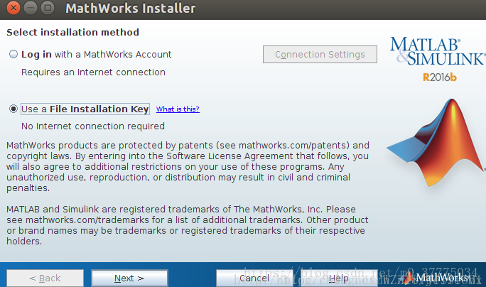
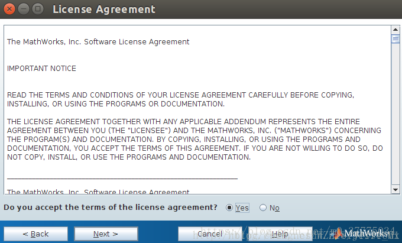

# linux-matlab

> 参考：https://blog.csdn.net/m0_37775034/article/details/80876362

此脚本用于在Linux系统安装Matlab

`Matlab2018aLinux64Crack.tar.gz` 用于破解

## 准备工作

```text
# 务必把此仓库下载到`~/Download`目录下
cd ~/Download
git clone https://github.com/ysl2/linux-matlab.git
# 检查此README的位置是否是`~/Download/linux-matlab/README.md`
```

把以下两个文件放到`~/Download/linux-matlab/`下。你可以在上面的文章中找到这两个文件

```text
R2018a_glnxa64_dvd1.iso
R2018a_glnxa64_dvd2.iso
```

## 安装

> 进行以下步骤前，确保你当前位置在`~/Download/linux-matlab`下

1. 执行`install-01.sh`

    - 选择 Use a File Installation Key

        

    - 选择Yes,同意条约

        

    - 选择`I have the File Installation Key for my license`,输入：

        ```text
        09806-07443-53955-64350-21751-41297
        ```

    - **不要**更改默认安装目录

    - 安装到某个进度会提示插入iso2,这个时候不要退出安装程序，另开一个shell，执行`install-02.sh`

2. 执行`install-02.sh`

    用于安装第二块盘

    安装完成选择finish

3. 执行`install-03.sh`

    用于破解及清理中间产物
